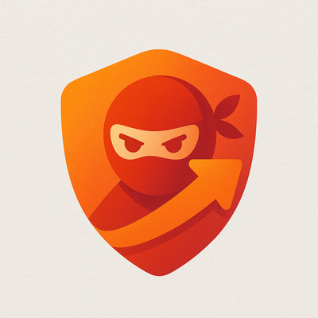

# RemoteAccess.Ninja Platform

**RemoteAccess.Ninja** is a fully self-hosted secure remote access and reporting platform. It leverages Nomad, Vault, PostgreSQL, and MinIO to deliver enterprise-grade infrastructure without SaaS lock-in.

## Project Vision

- Fully auditable and automated installation
- Hardened by default with strong operational security
- Modular deployment architecture for scalability and clarity

---

## Contents

- [Bootstrap Installation](../bootstrap/README.md)
- [Preflight Checks](../preflight/README.md)
- [Hardening Modules](../hardening/README.md)
- [Deployment Modules](../modules/README.md)
